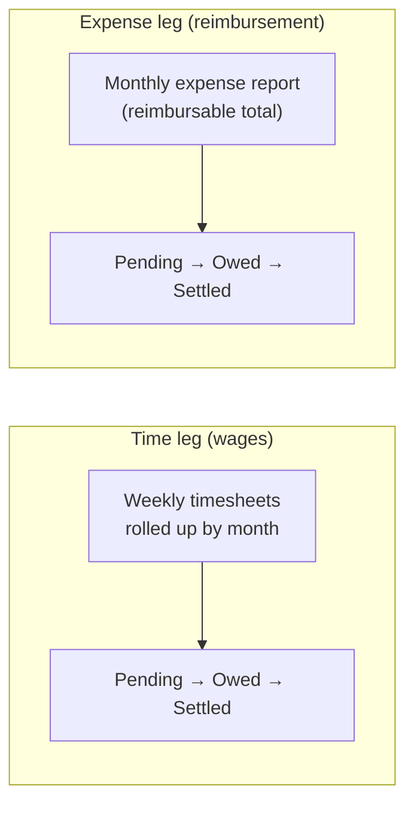

# Monthly Close — finance guide

[← User guides](README.md)

**Monthly Close** (left nav → **Monthly Close**, route `/monthly-close`) is the one
finance surface that brings an employee's two pay obligations — **time** (wages) and
**reimbursable expense** — together per employee, per month, and tracks each leg
through to its QuickBooks payment fact. It amends ADR-0082 with ADR-0083 (employee
finance). **The app never pays** — finance authorizes the actual payment in
QuickBooks; this surface just shows where each leg stands and lets finance flip the
approval/match steps it owns.

## Who can open it

This surface is **finance / admin only** (`canApprovePayroll`). Everyone else is
turned away with a clear notice — comp obligations are not a general-access surface.
Even here, the table shows **minutes and dollar amounts only, never pay rates**.

## The two legs

Each row is one **employee-month** with two independent legs:

- **Time leg** — the hours from the employee's weekly [timesheets](timesheets.md),
  rolled up by month, shown as `HH:MM` with a status (*Pending · Owed · Exception ·
  Settled*) and a per-week count. It deep-links into
  [Time Admin](../admin-guides/README.md) filtered to that employee.
- **Expense leg** — the **reimbursable total** of the employee's monthly
  [expense report](expenses.md), shown as a dollar amount with its state.

## The table

Sortable columns: **Employee · Month · Time · Time status · Reimbursable · Expense
status · action**. A filter bar narrows by employee name, status bucket (*All / Open
obligations / Exceptions / Settled*, each with a count), and a month-from / month-to
range.

The **action** per row depends on the expense leg's state:

| State | What finance does |
| --- | --- |
| **Approved** (by admin) | **Finance-approve expense** — the finance sign-off step. |
| **Finance approved**, obligation still open | **Confirm reimbursement** — opens the QuickBooks match panel. |
| **Exception** | *QB mismatch — review* — the backend reconciliation found a discrepancy; the auto-flip is blocked pending review. |
| **Settled** | *QB <paymentRef>* — the matched QuickBooks Purchase reference. |

## Confirming a reimbursement

**Confirm reimbursement** opens the match panel for the selected report (employee ·
period · reimbursable amount). The backend tries to find the matching QuickBooks
Purchase and tells you the result: a suggested match, *no automatic match*, or — when
QuickBooks reconciliation isn't wired in this environment — a prompt to enter the
payment id by hand (acceptable for UAT). Enter / confirm the QuickBooks Purchase id and
**Confirm reimbursed**.

A leg only flips **Paid / Reimbursed** when the backend matches the real QuickBooks
payment — the surface reflects money that actually moved, it never moves it.

## Honest empty state

If no timesheets or expense reports have landed for a month, there are no rows yet —
the page says so and notes that the backend QuickBooks reconciliation is **dormant
until credentials are configured**. It never breaks.

## Related

- [My Timesheets](timesheets.md) · [My Expenses](expenses.md) — the two employee-facing
  legs this surface rolls up.
- Time Admin / Employee Mapping / expense lifecycle:
  [admin-guides](../admin-guides/README.md).
