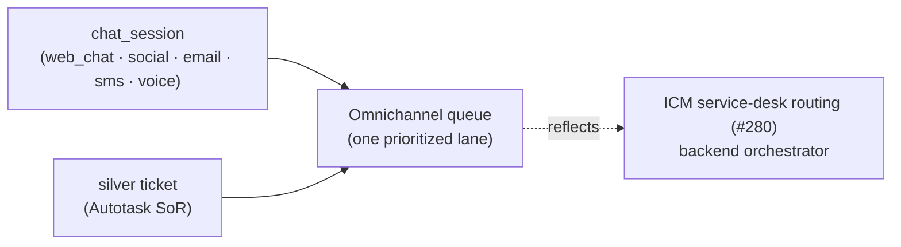

# Omnichannel queue — unified inbound triage

[← User guides](README.md)

The Omnichannel queue (left nav → **Omnichannel queue**, route `/service-desk`)
is the service desk's single prioritized work queue. It **aggregates inbound
across channels** — Imperion-native chat sessions (web chat, social, email,
SMS, voice) and Autotask tickets — into one list an agent can triage from one
surface (ADR-0074 §6, #408).

It is a **view, not a system of record.** The queue projects two existing
sources into one shape and orders them; it owns no new data:

- **Chat sessions** — the Imperion-native `chat_session` store (ADR-0074 §5,
  the only native service-desk table: pre-ticket / bot conversations +
  deflection telemetry). Written by the backend chat process; read here.
- **Tickets** — silver `ticket`, where **Autotask is the system of record**
  (ADR-0074 §1). Read through the existing ticket list.

## What you see

- **Headline** — *In queue* / *Open* / *Urgent* counts, plus an open-by-channel
  breakdown.
- **The queue** — one row per inbound item, ordered **open before closed, then
  by priority (urgent → low), then longest-waiting first**:
  - **Priority** — for a ticket, **SLA-driven**: derived from its SLA breach
    bucket (ADR-0074 §2: breached → urgent, at-risk → high, otherwise normal)
    via the `ticket_sla_breach` projection (migration 0118), read by the
    `listTicketSlaBreaches()` accessor and joined to the queue by ticket id
    (#671). A ticket with no projection row falls back to *normal*. For chat, a
    live human-handled session is urgent and a bot session is high.
  - **Channel · Subject · Account · Contact · Status · Received**.
  - **Routing** — the ICM lane the item routes to, or **unrouted** until that
    seam is wired (see below).
- Each subject deep-links to its source surface (**Communications** for chat,
  **Tickets** for tickets) where the actual work happens.

## Routing & assignment (coordinates ICM #280)

Active **routing and assignment are a backend process**, not a front-end one
(ADR-0042). They run through the **ICM service-desk routing workspace (#280)**
executed by the orchestrator — the queue is a single coordinated view over that
router, **not a second router** (ADR-0074 §6).

Until the ICM routing seam surfaces a lane to the front end, the page degrades
honestly: it shows a **read-only notice**, every item reads **unrouted**, and
you triage from the linked source surfaces. The page never breaks — it reflects
exactly what is wired (the repo's stub-don't-fail pattern). When routing lands,
the same surface will show the assigned lane with no layout change.

## Permissions

**Reads are open** to every role (rendering only; revenue stays redacted per
ADR-0030). The queue performs no writes today — triage actions happen on the
source surfaces, each behind its own capability (e.g. `tickets:write`).

## Future

- Surface the ICM #280 routing lane / assignee once the backend exposes it,
  and (ADR-0074 future) graduate routing from a view into an active assignment
  engine.
- Sharpen SLA priority once the pipeline promotes the real Autotask SLA
  timestamps to silver `ticket` (today the `ticket_sla_breach` view derives
  targets from `opened_at` + a priority-keyed contract-term policy, ADR-0044
  fallback; see migration 0118's follow-up note).
