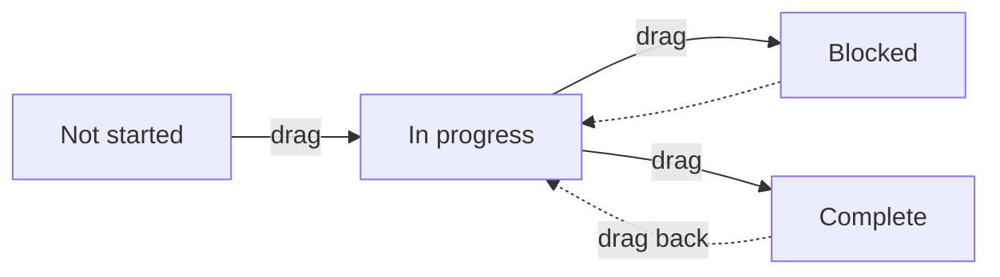

# Project board — the kanban view

[← User guides](README.md)

The Project board page (left nav → **Projects**) has two views, switchable from
the **List / Board** toggle below the page title. The **Board** is a drag-drop
kanban over the project object (ADR-0052), introduced in #441 (ADR-0066 C1) — the
sibling of the [task board](task-board.md).

## What you see

One column per **configurable status** (ADR-0065 B5, #613). The columns are no
longer a hard-coded four — they come from the `status_def` set an admin manages at
**Settings → Statuses** ([status administration](../admin-guides/status-administration.md)),
in the order and colours configured there. The seeded default set reproduces the
legacy statuses, so out of the box you still see:

### Per-project-type columns (#613)

Because the board spans every project type at once, its columns are the **union**
of the global default set and any **per-type** sets. So when an admin adds a status
to one type — e.g. **"Waiting on client"** to *Onboarding* — that status appears as
its own board column. Projects of types that don't define it simply have no card in
that column. Each status keeps the colour configured for it.

- Each column shows its project count.
- A card shows the project **name** (a link to the project), its **type** chip,
  the **account**, the **owner** when set, the **tag chips** (#439), and the
  **target go-live date** when set.
- The Board spans **all project types at once** — it is a single status view, not
  the per-type sections of the List. Switch to **List** for the type-grouped view
  and the project-type manager.

### Richer cards (#439)

A project card surfaces the **owner** line and the project's colour-coded **tag
chips** (ADR-0065 B6) — the same tags applied on the project detail page, read in
one bulk query for the visible board (no extra per-card fetch). Projects have no
subtask rollup. **Assignee avatars** and **comment / attachment counts** are the
deferred remainder — see *Not yet on the board*.

## Grouping (#443)

The **Group** switch (board view only) changes what the columns represent:

- **Status** (default) — Not started / In progress / Blocked / Complete.
- **Type** — one column per project type (from the live type table).

Dragging a card reassigns whichever dimension you are grouped by: drop a project
in another *Type* lane and it is re-typed (same `delivery:write` gate as a status
move). Grouping by owner waits on the owner reaching the board's read model.

## Swimlanes (#447)

The **Swimlane** switch (board view only) splits the board into collapsible
horizontal **bands** running *across* the columns:

- **None** (default) — one flat board.
- **Account** — one band per account.
- **Owner** — one band per owning user.
- **Type** — one band per project type.

The option that matches your current **Group** is hidden. Click a band header
(`▾` / `▸`) to collapse or expand it; projects with no owner land in an
**Unassigned** band. Dragging a card still only reassigns the **column**
dimension — a project keeps its band (account/owner/type), so dropping it into
another band's column snaps it back on the next refresh. WIP limits stay
per-column, counted across all bands.

## WIP limits (#445)

Each column header has a small number box — set a **work-in-progress limit**
(blank or `0` = none). When a column holds more cards than its limit, the column
turns **red** and the count shows `count/limit`. The limit is a personal nudge,
**not** a hard stop: you can still drop cards past it. Limits are saved in your
browser (per board, per group-by) and survive a reload — nothing is written to
the server.

## Moving a project

Drag a card to another column. The card jumps immediately (optimistic), and the
new status is saved through the same permission-gated path as the edit form
(`delivery:write`) — a move you are not allowed to make is rejected server-side.
The drop stamps **both** the new configurable status (`status_def_id`) and the
legacy status column it maps to, so reporting and the edit form stay in lockstep
during the compatibility window (#613). A custom status maps to the legacy enum by
its **category** (a `todo` status → *Not started*, `done` → *Complete*, otherwise
*In progress*); moving out of a *Not started*-category status stamps the project's
start time and a *Complete*-category status stamps its completion time — identical
to editing the status on the form. The board then re-reads server state, so what
you see always matches the record.

There is no separate "save"; the drop *is* the save.

## Not yet on the board

Tracked as follow-ups, deferred per ADR-0066 (SHOULD/COULD) or pending data:

- **Assignee avatars + comment / attachment counts on cards** — the rest of the
  C1-F4 rich-card set; the data exists but is read per-object, not in the board's
  bulk list path. Surfacing it needs a bulk read (no schema change), filed as the
  #439 F4 follow-up. (Owner + tags shipped in #439; group-by #443, WIP limits
  #445, swimlanes #447.)
- **Activity-feed event on a move** — #438, lands with the ADR-0064 feed.
