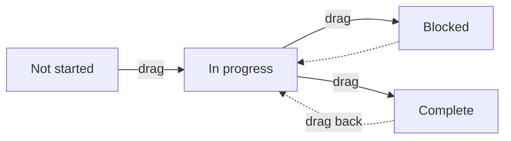

# Project board — the kanban view

[← User guides](README.md)

The Project board page (left nav → **Projects**) has two views, switchable from
the **List / Board** toggle below the page title. The **Board** is a drag-drop
kanban over the project object (ADR-0052), introduced in #441 (ADR-0066 C1) — the
sibling of the [task board](task-board.md).

## What you see

Four columns, one per project status:

- Each column shows its project count.
- A card shows the project **name** (a link to the project), its **type** chip,
  the **account**, and the **target go-live date** when set.
- The Board spans **all project types at once** — it is a single status view, not
  the per-type sections of the List. Switch to **List** for the type-grouped view
  and the project-type manager.

## Moving a project

Drag a card to another column. The card jumps immediately (optimistic), and the
new status is saved through the same permission-gated path as the edit form
(`delivery:write`) — a move you are not allowed to make is rejected server-side.
Moving out of *Not started* stamps the project's start time; moving to *Complete*
stamps its completion time — identical to editing the status on the form. The
board then re-reads server state, so what you see always matches the record.

There is no separate "save"; the drop *is* the save.

## Not yet on the board

Tracked as follow-ups, deferred per ADR-0066 (SHOULD/COULD) or pending data:

- **Group-by, swimlanes, WIP limits, richer cards** (assignee avatars, tags,
  subtask progress, comment/attachment counts) — #439.
- **Activity-feed event on a move** — #438, lands with the ADR-0064 feed.
