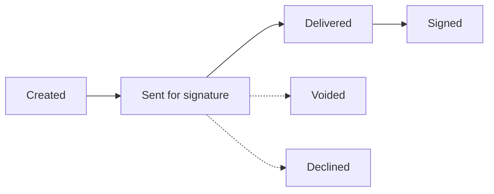

# Proposals & e-signature

[← User guides](README.md)

A **proposal** is the signable offer that turns a delivered
[assessment](assessments.md) into a contract. Proposals (left nav → **Proposals**,
route `/proposals`) is where you author one and watch it get signed. The proposal is
the signable artifact (ADR-0019); the contract is created from the signed proposal
(ADR-0044).

## The proposals list

A table: **Proposal · Account · Opportunity · Status · Value · Sent**, with **Edit**
and **Delete**. Status is colour-coded — *draft → sent → accepted → declined*. The
**Value** is revenue data, redacted for roles that can't see money.

**+ New proposal** creates one.

## Authoring a proposal

`/proposals/[id]/edit` (or `/proposals/new`) holds the form:

- **Title** (required) and the **Opportunity** it belongs to (required).
- **Status** — Draft / Sent / Accepted / Declined.
- **Monthly value (USD)**.
- **Document URL** — link to the proposal document.
- **Notes**.

## The signature panel

Below the form sits the **Signature** panel — the read-only e-signature state of the
proposal. It closes the loop that used to live outside the app: sales no longer leave
to sign elsewhere and hand-update the status by memory.

When an envelope exists, the panel shows the **status badge**, the provider
(DocuSign), sent / completed dates, any prior-attempt count, **per-signer states**
(order · name · role · status), and — once signed — a **signed-document** link served
by the backend from secured storage (the panel never exposes the raw storage
location).

**Honest empty state.** Sending a proposal for signature is a *backend* process
(DocuSign mints a JWT from Key Vault — the front end never holds the provider key), and
status arrives via a pipeline DocuSign Connect webhook. Until DocuSign consent lands,
the panel shows *No signature requested yet…* and explains that sending wires up
later. It never invents a status and never fails the page.

This guide covers the proposal screen; the focused
[signature-status](signature-status.md) guide goes deeper on the panel itself
(ADR-0071).

## Permissions at a glance

| Action | Capability |
| --- | --- |
| Read / create / edit a proposal | open to signed-in users |
| See the value | a revenue-visible role (redacted for Support) |
| Send for signature / void | a backend, approval-aware action (not on this surface) |

## Related

- [Security Readiness Assessments](assessments.md) — what precedes a proposal.
- [Signature status](signature-status.md) — the e-signature panel in depth.
- [Delivery templates](delivery-templates.md) / [Delivery board](delivery-board.md) —
  what provisioning a *won* proposal kicks off (behind the contract gate).
