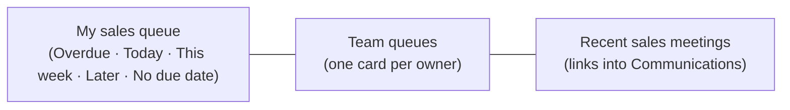

# Sales Activity — the Sales Queue

[← User guides](README.md)

The Sales Activity page (left nav → **Sales Activity**) is a rep's working
surface for sales tasks: your open sales tasks, grouped by due date and deal,
plus the team's queues and recent sales meetings. It is a **read model over the
one task object** (ADR-0052 §6) — a sales task is an ordinary task with
`category = sales`; the Tasks page still shows it in the cross-category view.

## What you see

- **My sales queue** — your open sales tasks, bucketed by due date (overdue
  first), each showing its deal and account.
- **Team queues** — everyone else's open sales tasks, one card per owner;
  tasks with no owner land under *Unassigned*.
- **Recent sales meetings** — the latest meeting interactions from the
  communications timeline; click through to the full meeting record.

## Working the queue

1. **Add a task** — fill the *New sales task* form (title, optional account /
   deal / due date). The task lands in *your* queue: you own what you create.
2. **Complete a task** — click **Complete** on the row. Completing twice is
   harmless (idempotent).
3. Need to edit a task's detail, due date, or owner? Open it from the
   **Tasks** page — full editing lives there.

## Permissions

- **Reads are open** to every role.
- **Writes** (create / complete) require the sales capability — admin or
  sales (`sales:write`, ADR-0045; GUI gate `canManageSales`, ADR-0052 §8).
  Without it the form and Complete buttons don't render, and the server
  refuses regardless.

## What sales tasks never do

Sales tasks are CRM-only: they **never push to Autotask** (ADR-0052 §6).
Project tasks are the ones that can become tickets.
