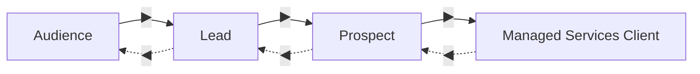
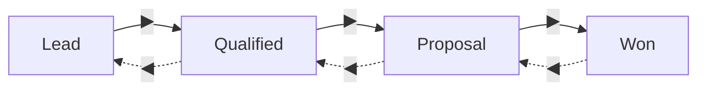

# Sales pipeline

[← User guides](README.md)

The Pipeline page (left nav → **Pipeline**, route `/pipeline`) is the interactive
sales board. It is really **two** boards stacked: a **Contact Lifecycle** board (where
each *person* sits in the relationship) and a **Deals by Sales Stage** board (where
each *opportunity* sits in the sales cycle). You advance a card with its arrow
buttons; there is no separate save.

## Contact lifecycle board

The top board moves people through the relationship. Four columns:

- Each column shows its contact count.
- Each card shows the **contact** name and their **account**.
- **◀ / ▶** move the contact back / forward a stage. The card moves immediately; the
  arrows are disabled at the ends.

## Deals by sales stage

The lower board moves opportunities (deals) through the sale. Four columns:

- Each column shows its deal count.
- Each card shows the **deal** name (a link to the Deal 360), the **company**, and its
  **MRR** (revenue-gated — redacted for roles that can't see money).
- **◀ / ▶** move the deal back / forward a stage.

## Moving a card

Both boards advance a card with the arrow buttons, and **the move is the save** — the
new stage is written through the same permission-gated path as the edit form. Moving a
contact lifecycle stage *or* a deal sales stage requires the `sales:write` capability;
without it the arrows are inert and the server refuses the change.

## The Deal 360

Click a deal name to open the **Deal 360** (`/pipeline/[id]`):

- **Deal** — sales stage, MRR (revenue-gated), and company.
- **Company** — a link straight to the [Company 360](accounts-360.md).
- **[Conversations](conversation-panel.md)** — call & meeting intelligence tied to
  *this* deal (read-only; empty until the conversational-intelligence pipeline is
  wired).

The Deal 360 is read-only for viewing — you move a deal on the Pipeline board, not
here.

## Permissions at a glance

| Action | Capability |
| --- | --- |
| Read the boards / Deal 360 | open to signed-in users |
| Move a contact lifecycle stage | `sales:write` |
| Move a deal sales stage | `sales:write` |
| See MRR | a revenue-visible role (redacted for Support) |

## Related

- [Contacts & the Contact 360](contacts-360.md) · [Accounts & the Company 360](accounts-360.md)
- [Discovery calls](discovery-calls.md) — what a qualified prospect goes into next.
- [Forecast](forecast-view.md) — the weighted / categorised rollup of this pipeline.
