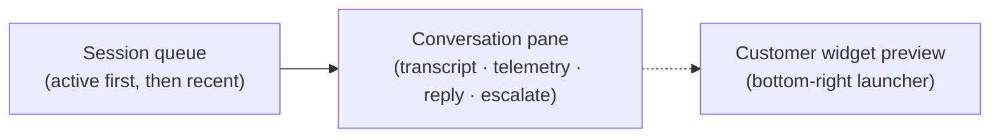

# Service Desk — live chat agent console

[← User guides](README.md)

The Service Desk page (left nav → **Service Desk**) is the support agent's live-chat
console: active chat sessions, transcripts, deflection telemetry, and one-click
escalation to an Autotask ticket. It surfaces the Imperion-native `chat_session` read
model (migration 0117) and is the front-end half of **ADR-0074** (service-desk depth).

**The scope boundary (ADR-0074, ratified).** Autotask is the ticket system of record.
Imperion keeps a native store ONLY for what Autotask does not model — a *pre-ticket*
chat session and *deflection telemetry* (a conversation that never became a ticket).
Everything ticket-resident lives in Autotask: escalation files a ticket via the
Autotask API, which rounds back through the existing pull → bronze → silver `ticket`.
There is **no** authoritative SLA store and **no** standalone CSAT store here.

## What you see

- **Session queue** — every chat session (most recent first; *active* — bot/live —
  float to the top). Each row shows the visitor (or *Anonymous visitor*), channel,
  account, status, and how long ago it started. The footer shows the **deflection
  telemetry** headline: total sessions, deflected count, and the deflection rate
  (ADR-0074 §4 / BI hub ADR-0062).
- **Conversation pane** — the selected session's transcript *preview* (the full
  transcript stays in governed blob, written by the backend — it may carry PII), its
  deflection / escalation badges, an **agent reply** box, and the **escalate to
  Autotask ticket** form.
- **Customer chat widget** — a live preview of the widget visitors use. It pins a
  launcher to the bottom-right of the page; open it to try the customer experience.

## Working a session

1. **Select a session** in the queue to load its transcript and telemetry.
2. **Reply** — type into the reply box and send. A reply is recorded against the
   session; the agent reply path posts through the backend chat process.
3. **Escalate to a ticket** — expand *Escalate to Autotask ticket*, attach an
   **account** (required — a ticket needs one; a pre-ticket session is often
   anonymous), give the ticket a title and optional description, and **File Autotask
   ticket**. Escalation is **idempotent** on the originating session, so a
   double-click or retry can never file two tickets — it returns the existing ticket
   reference. The ticket appears under **Tickets** after the next Autotask sync.

## The customer-facing widget

The `LiveChatWidget` component (`src/components/service-desk/live-chat-widget.tsx`) is
the embeddable visitor experience: a launcher → chat panel. An inbound message is
answered first by a bot grounded in gold knowledge (ADR-0041); on failure it escalates
to a person or an Autotask ticket. Wiring a real backend is additive — pass an
`onSend` hook that posts to the chat host; with no hook the widget degrades to an
honest preview that records the message and tells the visitor an agent will follow up.

## Honest degradation (ADR-0018)

Real-time chat **transport** (delivering replies, driving the bot/live handover) is a
backend process hosted off this repo. Until it is wired (`COMMS_SERVICE_URL` unset),
the console is a **read/poll view**: sessions and telemetry render from the database, a
reply is *recorded but not delivered*, and a banner says so. **Escalation still works**
whenever the integration backend (`INTEGRATION_SERVICE_URL`) is reachable — it does not
depend on chat transport.

## Permissions

- **Read** — any signed-in user can view the console (rendering reads are broadly
  available; ADR-0030).
- **Reply / escalate** — gated on the `tickets:write` capability (support, sales,
  project_manager, or admin; ADR-0045). The controls are read-only without it, and the
  server actions fail closed regardless of the UI.

## Related

- ADR-0074 — service-desk depth (SLA, CSAT/NPS, live chat, deflection, routing).
- `src/lib/chat-session.ts` — the deflection-telemetry rollup read model (#403).
- `src/lib/chat-live.ts` — the console/widget display helpers (#407).
- The omnichannel routing **queue** (#408) folds chat into one inbound queue
  alongside email/social — coordinated with the ICM service-desk workspace (#280).
