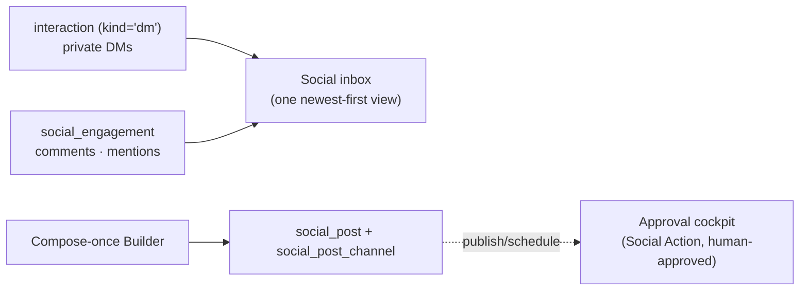

# Social — unified inbox + compose-once publishing

[← User guides](README.md)

The Social surface (left nav → **Marketing → Social**, route `/social`) is the
Social Media Management plane's operator front end (ADR-0124, epic #1338). It does
three things: a **unified inbound inbox**, a **compose-once → fan-out publishing**
surface, and an **in-plane analytics** view. Belle (Marketing) owns the channel; the
surface rides the marketing role gate (admin | sales).

It is a **view + a composer, not a system of record for outbound.** It reads the
silver social tables directly for rendering, and every outbound act (reply, publish,
boost) is a **Social Action** routed through the approval cockpit — human-approved in
v1 (ADR-0124 #4, ADR-0058).

## Inbox

The **Inbox** tab folds the two halves of the ADR-0124 inbound split back into one
list (newest first), filterable by network:

- **DMs** — private direct messages from the [`interaction`](../database/semantic-layer/tables/interaction.md)
  timeline (`kind='dm'`), across Facebook / Instagram / Messenger / Threads / LinkedIn.
- **Comments & mentions** — public engagements from
  [`social_engagement`](../database/semantic-layer/tables/social_engagement.md), kept
  off the Interaction timeline on purpose (they are often anonymous; keeping them off
  the timeline keeps Contact-360 clean). Each row shows its **triage status**
  (new / triaged / replied / dismissed), its **intent** (lead / support / brand), and
  the **routed agent** (Chase / Felix / Belle) once slice G classifies it.

Each inbox row carries a **Reply** button (marketing role only) on the channels that have a
seeded reply action — Facebook, Instagram, Messenger, Threads. Drafting a reply **proposes**
a governed Social Action (`social_reply_*`, mapped from the row's channel; an Instagram DM
routes to `social_reply_ig_direct`) to the **approval cockpit** — it is **human-approved in
v1, never sent directly** (ADR-0124 #4, ADR-0058). The inbox itself is fully live the moment
the collectors hydrate the source tables (slice H).

## Publishing

The **Publishing** tab lists every **Social Post** — a compose-once composition — with
its per-network fan-out summary (one
[`social_post_channel`](../database/semantic-layer/tables/social_post_channel.md) chip per
network, coloured by publish status). **Compose post** opens the Builder (ADR-0053):

1. Write the copy **once**.
2. Pick the networks to **fan out** to (one channel chip each); a per-network preview
   shows the copy with that network's soft character limit.
3. Optionally attribute it to a marketing **campaign**.
4. **Save as draft**, or schedule a publish time.

Saving **persists** the draft via the backend save endpoint (`POST /api/social/posts`,
BE #429) — nothing publishes from here. Clicking a post opens its **detail page**
(`/social/publishing/[id]`): the authored copy, the per-network fan-out rows
(`social_post_channel`, coloured by publish status), and the **Outbound actions** strip.

From there (marketing role only):

- **Publish `<channel>`** proposes the channel's seeded publish action
  (`social_publish_fb_post` / `social_publish_ig_media` / `social_post_threads`) to the
  approval cockpit.
- **Boost post** proposes `social_boost_post` — minting a paid ad
  (`boosted_from_social_post_id`, ADR-0124 #6) with the budget the approver sets. Boost is
  a **`financial`** action (ADR-0109 HARD money ceiling) and is only offered once a channel
  is published.

Every one of these is **human-approved in v1, never sent directly** (ADR-0124 #4, ADR-0058).

## Analytics

The **Analytics** tab (`/social/analytics`, slice D #1342) is the plane's in-plane
performance view. It folds two silver time-series together **in the data layer** (no DB
view, no migration — `SocialRepository.analytics()`):

- **Organic — per channel & per post.** Every named measure from
  [`social_metric`](../database/semantic-layer/tables/social_metric.md) (reach, impressions,
  followers, engagement, …), grouped per platform (lifetime latest + the 28-day daily sum)
  and per published post (a [`social_post_channel`](../database/semantic-layer/tables/social_post_channel.md)
  joined to its post-grain snapshots by platform `external_id`). The view is
  **metric-name-tolerant** (#135 normalization is still in flight, slice H): it humanizes and
  renders whatever metric names exist rather than a fixed whitelist, so new/retuned names
  still show.
- **Paid — per ad.** The [`campaign_metric`](../database/semantic-layer/tables/campaign_metric.md)
  ad grain (paid-only, ADR-0012) rolled up to spend / impressions / clicks / **results**
  (attributed leads) / **cost-per-lead**. This is the shape **Marketing Attribution (#1316)**
  consumes — ad results exposed as `{ adId, results, cpl }`.

The same read powers the **social/ad tiles on the BI hub** (`/reporting#marketing`, ADR-0062):
channels-reporting, ad spend, ad results, blended CPL, and a top-ads table that deep-links
back to this view. **Ad spend and CPL are revenue figures** — redacted server-side by the
revenue gate (ADR-0030, `canSeeRevenue`) before reaching the client; counts always show.

The view is fully live the moment the collectors hydrate `social_metric` / `campaign_metric`
(slice H); until then it renders the dormant empty state, never an error.

## Why the GUI never writes the post directly

The web role has **SELECT-only** on `social_post` / `social_post_channel` (migration
0210 grant). Persisting a composition is a backend *process* (every process calls the
backend, ADR-0042 §1) — so the compose Builder forwards the draft to the backend save
endpoint (`POST /api/social/posts`, BE #429) rather than writing the table. The reply,
publish, and boost actions are the **11 seeded Social Action kinds** (`agent_tool_grant`
for Belle, migration 0209): the GUI **proposes** the right `action_kind` and the backend
dispatcher (BE #418) parks it on the pending-action cockpit + executes on approval. The
front end holds no publishing credential and calls no network directly. These flows are
**deploy-dormant** until the backend trigger-sync (#119) and the per-channel tokens land —
the expected state, not a bug.

## Security

- **Reads** are gated `data_class=operational` (the demand-gen plane); third-party author
  PII on engagements rests on legitimate interest (ADR-0025 lawful-basis note), and any
  outbound re-asserts consent via the consent ledger.
- **All outbound** (reply / publish / boost) is cockpit-gated and human-approved in v1.
- The GUI holds **no** publishing credential — the `conn-company-*` Key Vault secrets stay
  backend-side.
