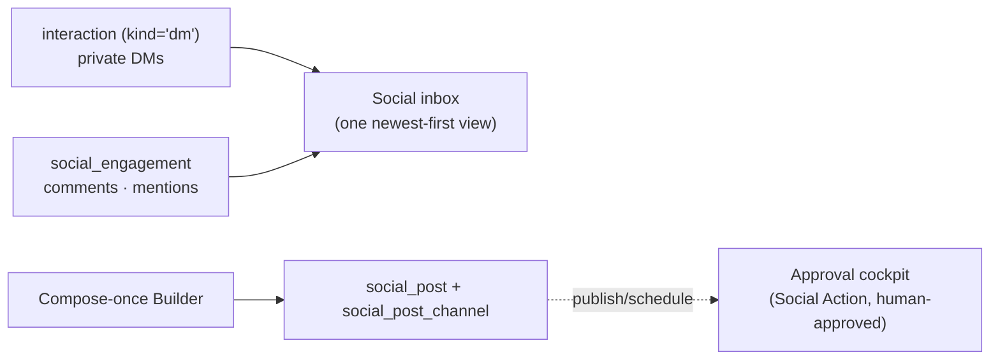

# Social — unified inbox + compose-once publishing

[← User guides](README.md)

The Social surface (left nav → **Marketing → Social**, route `/social`) is the
Social Media Management plane's operator front end (ADR-0124, epic #1338). It does
two things: a **unified inbound inbox** and a **compose-once → fan-out publishing**
surface. Belle (Marketing) owns the channel; the surface rides the marketing role
gate (admin | sales).

It is a **view + a composer, not a system of record for outbound.** It reads the
silver social tables directly for rendering, and every outbound act (reply, publish,
boost) is a **Social Action** routed through the approval cockpit — human-approved in
v1 (ADR-0124 #4, ADR-0058).

## Inbox

The **Inbox** tab folds the two halves of the ADR-0124 inbound split back into one
list (newest first), filterable by network:

- **DMs** — private direct messages from the [`interaction`](../database/semantic-layer/tables/interaction.md)
  timeline (`kind='dm'`), across Facebook / Instagram / Messenger / Threads / LinkedIn.
- **Comments & mentions** — public engagements from
  [`social_engagement`](../database/semantic-layer/tables/social_engagement.md), kept
  off the Interaction timeline on purpose (they are often anonymous; keeping them off
  the timeline keeps Contact-360 clean). Each row shows its **triage status**
  (new / triaged / replied / dismissed), its **intent** (lead / support / brand), and
  the **routed agent** (Chase / Felix / Belle) once slice G classifies it.

Replying is a cockpit-gated Social Action (wired in the follow-up). The inbox itself is
fully live the moment the collectors hydrate the source tables (slice H).

## Publishing

The **Publishing** tab lists every **Social Post** — a compose-once composition — with
its per-network fan-out summary (one
[`social_post_channel`](../database/semantic-layer/tables/social_post_channel.md) chip per
network, coloured by publish status). **Compose post** opens the Builder (ADR-0053):

1. Write the copy **once**.
2. Pick the networks to **fan out** to (one channel chip each); a per-network preview
   shows the copy with that network's soft character limit.
3. Optionally attribute it to a marketing **campaign**.
4. **Save as draft**, or schedule a publish time.

Saving **drafts** the post — nothing publishes from here. Publishing, scheduling, and
boosting a post into a paid ad are Social Actions through the approval cockpit.

## Why the GUI never writes the post directly

The web role has **SELECT-only** on `social_post` / `social_post_channel` (migration
0210 grant). Persisting a composition is a backend *process* (every process calls the
backend, ADR-0042 §1) — so the compose Builder forwards the draft to the backend save
endpoint rather than writing the table. Until that endpoint is wired the composer
degrades **honestly**: it tells you nothing was persisted rather than faking a saved
draft (stubbed-not-broken). The backend save/schedule endpoint + the reply/publish/boost
action wiring are tracked as follow-ups under epic #1338.

## Security

- **Reads** are gated `data_class=operational` (the demand-gen plane); third-party author
  PII on engagements rests on legitimate interest (ADR-0025 lawful-basis note), and any
  outbound re-asserts consent via the consent ledger.
- **All outbound** (reply / publish / boost) is cockpit-gated and human-approved in v1.
- The GUI holds **no** publishing credential — the `conn-company-*` Key Vault secrets stay
  backend-side.
