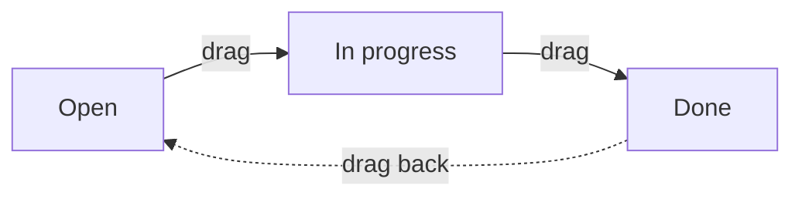

# Task board — the kanban view

[← User guides](README.md)

The Tasks page (left nav → **Tasks**) has two views, switchable from the
**List / Board** toggle in the top-right. The **Board** is a drag-drop kanban
over the one task object (ADR-0052), introduced in #341 (ADR-0066 C1).

## What you see

Three columns, one per task status:

- Each column shows its task count.
- A card shows the task **title**, its **category** chip (Sales / Project /
  Onboarding / General), the **account**, and the **due date** when set.
- The board honours the **category filter** — pick a category and the board
  shows only that category, exactly like the list.

### Richer cards (#439)

Beyond the basics, a card surfaces what the list read already carries — no extra
fetch:

- **Subtask progress** — a task with subtasks (ADR-0065 B1) shows an `done/total`
  pill in the top-right; it turns **green** when every subtask is done.
- **Tags** — the task's colour-coded tag chips (ADR-0065 B6) appear under the
  category/account line, the same chips the list view and tag filter show.

**Assignee avatars** and **comment / attachment counts** are not on the card yet:
the board's list read does not carry them in bulk, and adding that is a read-side
follow-up (no schema change) — see *Not yet on the board*.

## Grouping (#443)

The **Group** switch (board view only) changes what the columns represent:

- **Status** (default) — Open / In progress / Done.
- **Category** — Sales / Project / Onboarding / General.

Dragging a card reassigns whichever dimension you are grouped by: drop a card in
the *Onboarding* lane while grouped by category and the task's category becomes
Onboarding (same `delivery:write` gate as a status move). Grouping by assignee or
tag waits on that data landing (ADR-0064/0065).

## Swimlanes (#447)

The **Swimlane** switch (board view only) splits the board into collapsible
horizontal **bands** — a second grouping that runs *across* the columns:

- **None** (default) — one flat board.
- **Account** — one band per account.
- **Category** — one band per category (Sales / Project / Onboarding / General).

The option that matches your current **Group** is hidden (no point swimlaning by
the same thing the columns already split). Click a band header (`▾` / `▸`) to
collapse or expand it. Tasks with no account land in an **Unassigned** band.

Dragging a card still only reassigns the **column** dimension — a card keeps its
swimlane (its account/category), so dropping it into another band's column snaps
it back to its own band on the next refresh. WIP limits stay per-column, counted
across all bands. Swimlane-by-assignee waits on that data (ADR-0064/0065).

## WIP limits (#445)

Each column header has a small number box — set a **work-in-progress limit**
(blank or `0` = none). When a column holds more cards than its limit, the column
turns **red** and the count shows `count/limit`. The limit is a personal nudge,
**not** a hard stop: you can still drop cards past it. Limits are saved in your
browser (per board, per group-by), so they are yours alone and survive a reload —
nothing is written to the server.

## Moving a task

Drag a card to another column. The card jumps immediately (optimistic), and the
new status is saved through the same permission-gated path as the edit form
(`delivery:write`) — a move you are not allowed to make is rejected server-side.
The board then re-reads server state, so what you see always matches the record.

There is no separate "save"; the drop *is* the save.

## Not yet on the board

Tracked as follow-ups, deferred per ADR-0066 (SHOULD/COULD) or pending data:

- **Assignee avatars + comment / attachment counts on cards** — the rest of the
  C1-F4 rich-card set. The data exists (ADR-0064 comments, ADR-0065 B3
  assignees) but is read per-object, not in the bulk list path the board uses;
  surfacing it needs a bulk read (no schema change). Filed as the #439 F4
  follow-up. (Subtask progress + tags shipped in #439; group-by #443, WIP limits
  #445, swimlanes #447; the projects board in #441 — see
  [Project board](project-board.md).)
- **Activity-feed event on a move** — #438, lands with the ADR-0064 feed.

For sales tasks specifically, see [Sales Activity](sales-activity.md).
