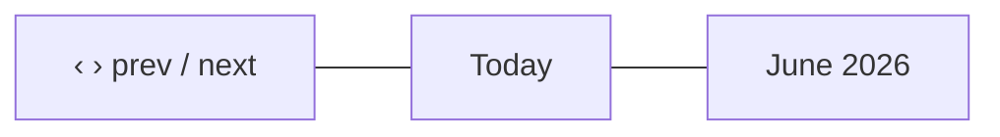

# Task calendar — the month view

[← User guides](README.md)

The Tasks page (left nav → **Tasks**) has three views, switchable from the
**List / Board / Calendar** toggle in the top-right. The **Calendar** lays your
tasks out on a month grid by **due date**, and lets you drag a task to another
day to reschedule it. Introduced in #342 (ADR-0066 C2), over the one task object
(ADR-0052) — no new data, it renders the due date the task already has.

## What you see

A standard month grid, Sunday-first, six weeks tall so the layout never jumps as
you page between months:

- The **‹** / **›** arrows page to the previous / next month; **Today** jumps
  back to the current month.
- Each task sits on its **due-date** cell, showing the **title** with a
  left-edge colour for its category (Sales / Project / Onboarding / General).
  A **done** task is struck through.
- Today's cell number is circled.
- The calendar honours the **category filter** and the **tag filter** — narrow
  the set and the calendar shows only the matching tasks, exactly like the list
  and board.
- Click a task to open it for editing.

## Rescheduling a task

Drag a task onto another day. The card jumps immediately (optimistic), and the
new due date is saved through the same permission-gated, **audited** path as the
edit form (`delivery:write`) — a reschedule you are not allowed to make is
rejected server-side. The calendar then re-reads server state, so what you see
always matches the record.

There is no separate "save"; the drop *is* the save.

## Tasks without a due date

A task with no due date has no day to sit on, so it is **not** shown on the
calendar — a note under the grid tells you how many are hidden. Give a task a due
date (on the list, the board card, or its edit form) to place it on the calendar,
or use the **List** view to see everything regardless of due date.

## Not yet on the calendar

Tracked as follow-ups, deferred per ADR-0066:

- **Week view** and a **`start_at`→due span** (a task drawn across the days it
  runs, not just a dot on its due date) — both wait on the shared `task.start_at`
  column, which also feeds the timeline / Gantt (C3). Filed as a follow-up; until
  then the calendar is month-by-due-date only.
- **Assignee filter / per-assignee colouring** — waits on the assignee data
  (ADR-0064/0065), same as the board.
- **Activity-feed event on a reschedule** — #438, lands with the ADR-0064 feed
  (the reschedule is already audited via the standard mutation path).

For the kanban view see [Task board](task-board.md); for sales tasks
specifically see [Sales Activity](sales-activity.md).
