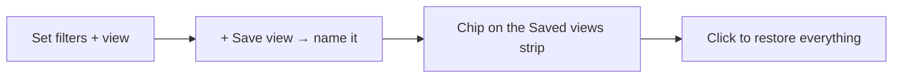

# Task saved views — the multi-view toggle + saved filters

[← User guides](README.md)

The Tasks page (left nav → **Tasks**) shows one dataset through several
**views** — **List / Board / Calendar** — switchable from the toggle in the
top-right. Switching a view **keeps your active filters**: category, group,
swimlane and tag all ride along in the page URL, so going List → Board on a
"Project / urgent" set lands you on the same set, just laid out differently
(ADR-0066 C4, #344; the view toggle itself is C1/C2, #342).

On top of that, you can **name and recall** a filter set as a **saved view**.

## Switching views keeps your filters

The List / Board / Calendar toggle, the category filter, the board **Group** /
**Swimlane** controls, and the tag strip all encode their state in the page
address. So:

- Pick **Project** + tag **urgent**, switch to **Board** → still Project +
  urgent, now as a kanban.
- Switch to **Calendar** → the same tasks on a month grid by due date.
- Your selection survives a page reload and is shareable — copy the URL and a
  colleague opens the exact same view.

## Saving a view

The **Saved views** strip sits under the toggle row.

- Set up the filters / view you want, then click **+ Save view**, type a name
  (e.g. *My urgent project work*), and press **Save** (or Enter).
- The saved view appears as a chip. Click it any time to **restore the whole
  filter set in one click** — view, category, group, swimlane and tag together.
- The chip for the view you are currently looking at is highlighted, and
  **+ Save view** reads **Saved** so you do not save the same filter set twice.
- Click the **×** on a chip to delete that saved view.

## Where saved views live (and what that means)

Saved views are **per-user and stored in your browser** — there is **no new
database column** for them (this C4 lane carries no schema migration). Practical
consequences:

- They are private to you and persist across sessions **on this browser**.
- They do **not** follow you to another machine or browser, and clearing site
  data removes them.
- Up to **20** saved views are kept.

**Shared / org-wide saved views** (a saved view visible to the whole team) need a
stored, server-side view object and are a tracked follow-up under ADR-0066 — see
the issue thread on #344. **Sort and group-by** beyond the board's existing
Group / Swimlane controls (e.g. a saved sort order on the list) follow the same
path; today the saved view captures exactly what the URL encodes.

For the kanban view see [Task board](task-board.md); for the month grid see
[Task calendar](task-calendar.md).
