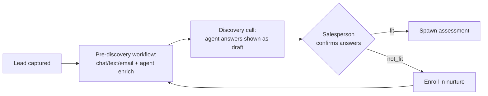

# Workflows

Business workflow docs and swim-lane / process maps (lead to onboarding to handoff to customer success).

See `CLAUDE.md` section 8 and the project standards doc for required fields.

## Automation model (ADR-0014/0027)

Nurture and pre-discovery sequences are modelled in-app as `workflow` →
`workflow_step` → `workflow_enrollment`. Power Automate only fires the actual
send/notify — no core logic lives there (CLAUDE.md §3).

- **`workflow.kind`**: `nurture | pre_discovery | re_engagement`.
- **`workflow_step.kind`**: `send_email | send_sms | chat_prompt | agent_enrich |
  wait | branch`. Outreach steps that send are consent-gated (ADR-0014).
- **`workflow_enrollment`**: a contact's position in a sequence (`active | completed |
  exited`).

### Pre-discovery automation → human approval → fit/nurture (ADR-0027)

Before a discovery call, a `pre_discovery` workflow gathers discovery data via
chat/text/email + agent enrichment, pre-filling `engagement_answer` rows as **draft**
(`source = agent|automation`, with a `confidence`). In the call the salesperson
**confirms/stamps** or rejects each (`confirmAnswer` / `rejectAnswer`, recording the
approving user), then sets the verdict:

- **fit →** spawn an assessment (engagement provenance FKs, ADR-0023).
- **not_fit →** enroll the contact in a nurture workflow.

Workflow execution (running steps, generating draft answers) runs in external
functions (ADR-0018); the current scaffold defines the store, the approval gate, and
the fit/nurture routing.
