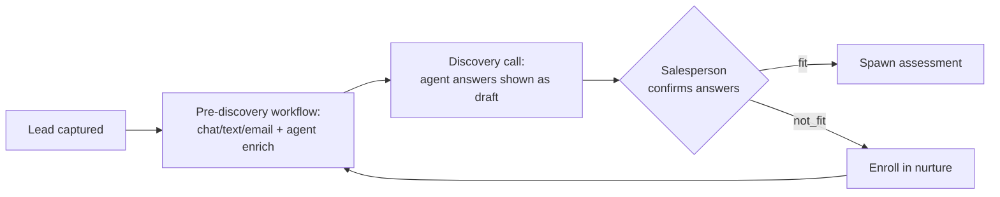

# Workflows

Business workflow docs and swim-lane / process maps (lead to onboarding to handoff to customer success).

See `CLAUDE.md` section 8 and the project standards doc for required fields.

## Automation model (ADR-0014/0027)

Nurture and pre-discovery sequences are modelled in-app as `workflow` →
`workflow_step` → `workflow_enrollment`. Power Automate only fires the actual
send/notify — no core logic lives there (CLAUDE.md §3).

- **`workflow.kind`**: `nurture | pre_discovery | re_engagement`.
- **`workflow_step.kind`**: `send_email | send_sms | chat_prompt | agent_enrich |
  wait | branch`. Outreach steps that send are consent-gated (ADR-0014).
- **`workflow_enrollment`**: a contact's position in a sequence (`active | completed |
  exited`).

### Pre-discovery automation → human approval → fit/nurture (ADR-0027)

Before a discovery call, a `pre_discovery` workflow gathers discovery data via
chat/text/email + agent enrichment, pre-filling `engagement_answer` rows as **draft**
(`source = agent|automation`, with a `confidence`). In the call the salesperson
**confirms/stamps** or rejects each (`confirmAnswer` / `rejectAnswer`, recording the
approving user), then sets the verdict:

- **fit →** spawn an assessment (engagement provenance FKs, ADR-0023).
- **not_fit →** enroll the contact in a nurture workflow.

Workflow execution (running steps, generating draft answers) runs in external
functions (ADR-0018); the current scaffold defines the store, the approval gate, and
the fit/nurture routing.

## Marketing journeys (ADR-0073, #399)

A marketing **journey** is the same `workflow` substrate, not a second engine: a
`workflow` row with `kind = 'journey'` whose ordered steps, A/B variants, and source
segments live embedded in `workflow.definition` (jsonb). There are **no**
`journey_step` / `journey_enrollment` child tables — the journey is authored,
versioned, and reasoned about as one object (ADR-0073 decision 1, migration 0115).
Enrollment reuses `workflow_enrollment` (one active per `(workflow, contact)`,
idempotent).

- **Step kinds**: `send` (composer template, gated per ADR-0058 — A/B variants are
  send-step config, sticky per enrollee) · `wait` (delay in hours) · `branch`
  (engagement predicate `opened|clicked|replied|bounced|no_action` → if/else step) ·
  `score` (lead-score delta) · `exit`.
- **Surface** (this repo, GUI only): `/journeys` (list) → `/journeys/[id]` (read-only
  flow viewer, #397) → `/journeys/[id]/edit` (the **builder**, #399 — add/reorder/edit
  steps, author A/B variants, live structural validation). Create at `/journeys/new`.
  The builder edits the single in-memory object and saves the whole `definition` back
  via the data layer (`createJourney` / `saveJourney`); the server action re-parses the
  untrusted blob through `lib/journey.ts` before persisting.
- **Honest degradation**: enrollment **targeting is disabled** in the builder because
  the `segment` / `segment_member` model has no schema yet (#420 / #421, ADR-0073
  decision 2) — the journey still authors + saves, it just cannot enrol until segments
  land. Composer template fields are free-text ids until a template index is wired.
- **No gate bypass** (ADR-0058/0055): authoring a send step does not send; the backend
  journey runner (#398) crosses the approval gate + autonomy dial at runtime. This
  front end authors structure only (ADR-0042).
