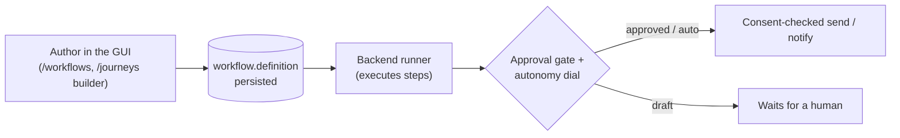
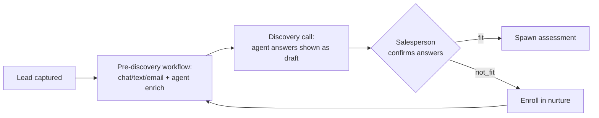

# 🔁 Workflows

How Imperion OS automates business processes — the **in-app workflow
engine** that drives nurture, pre-discovery, re-engagement, and marketing journeys, plus
the human-approval and consent gates woven through all of it. This README is the
onboarding map; the step-by-step authoring and runtime walkthrough lives in
**[workflow-automation-guide](workflow-automation-guide.md)**.

[← Documentation library](../README.md) ·
[Workflow automation guide](workflow-automation-guide.md) ·
[Customer lifecycle](../architecture/customer-lifecycle.md) ·
[Agents](../agents/README.md)

---

## The core idea

A **workflow** is a sequence of steps a contact moves through — and it is **one
substrate**, not many engines. Nurture campaigns, pre-discovery data-gathering,
re-engagement, and marketing journeys are all the same `workflow` / `workflow_step` /
`workflow_enrollment` model with a different `kind`. Power Automate only fires the actual
send/notify; **no core business logic lives there** (CLAUDE.md §3).

Two rules sit above everything:

- **Authoring is not sending.** This repo is GUI-only (ADR-0042). Designing a step that
  *would* send does not send anything — the backend runner crosses the **approval gate**
  and the **autonomy dial** at runtime (ADR-0058/0055).
- **Consent gates every outreach.** Any step that sends is consent-gated (ADR-0014), and
  consent is re-asserted at execution time.

---

## The workflow kinds

| `workflow.kind` | Purpose |
| --- | --- |
| `nurture` | Segmented email/SMS nurture sequences (the GTM tracks). |
| `pre_discovery` | Gather discovery data before a call, as drafts a human confirms. |
| `re_engagement` | Re-warm dormant contacts. |
| `journey` | A marketing journey — the same substrate, authored as one object (ADR-0073). |

**Step kinds** (`workflow_step.kind`): `send_email` · `send_sms` · `chat_prompt` ·
`agent_enrich` · `wait` · `branch`. Marketing journeys use a journey-flavored step set:
`send` · `wait` · `branch` · `score` · `exit`. Outreach steps that send are consent-gated
(ADR-0014). **`workflow_enrollment`** records a contact's position in a sequence
(`active | completed | exited`).

---

## Pre-discovery: automation → human approval → fit/nurture (ADR-0027)

Before a discovery call, a `pre_discovery` workflow gathers discovery data via
chat/text/email plus agent enrichment, pre-filling `engagement_answer` rows as **draft**
(`source = agent|automation`, with a `confidence`). In the call the salesperson
**confirms/stamps** or rejects each (`confirmAnswer` / `rejectAnswer`, recording the
approving user), then sets the verdict:

- **fit →** spawn an assessment (engagement provenance FKs, ADR-0023).
- **not_fit →** enroll the contact in a nurture workflow.

Workflow execution (running steps, generating draft answers) runs in external functions
(ADR-0018); the current front-end scaffold defines the store, the approval gate, and the
fit/nurture routing.

---

## Marketing journeys (ADR-0073, #399)

A marketing **journey** is the same `workflow` substrate, not a second engine: a
`workflow` row with `kind = 'journey'` whose ordered steps, A/B variants, and source
segments live embedded in `workflow.definition` (jsonb). There are **no**
`journey_step` / `journey_enrollment` child tables — the journey is authored, versioned,
and reasoned about as one object (ADR-0073 decision 1, migration 0115). Enrollment reuses
`workflow_enrollment` (one active per `(workflow, contact)`, idempotent).

- **Step kinds**: `send` (composer template, gated per ADR-0058 — A/B variants are
  send-step config, sticky per enrollee) · `wait` (delay in hours) · `branch`
  (engagement predicate `opened|clicked|replied|bounced|no_action` → if/else step) ·
  `score` (lead-score delta) · `exit`.
- **Surface** (this repo, GUI only): `/journeys` (list) → `/journeys/[id]` (read-only flow
  viewer, #397) → `/journeys/[id]/edit` (the **builder**, #399 — add/reorder/edit steps,
  author A/B variants, live structural validation). Create at `/journeys/new`. The builder
  edits the single in-memory object and saves the whole `definition` back via the data
  layer (`createJourney` / `saveJourney`); the server action re-parses the untrusted blob
  through `lib/journey.ts` before persisting.
- **Honest degradation**: enrollment **targeting is disabled** in the builder because the
  `segment` / `segment_member` model has no schema yet (#420 / #421, ADR-0073 decision 2)
  — the journey still authors and saves, it just cannot enrol until segments land.
  Composer template fields are free-text ids until a template index is wired.
- **No gate bypass** (ADR-0058/0055): authoring a send step does not send; the backend
  journey runner (#398) crosses the approval gate + autonomy dial at runtime. This front
  end authors structure only (ADR-0042).

---

## Where this fits

- **The full map of business processes** — every **Operating Procedure** that runs the
  MSP, projected onto its one owning agent — is the
  [Operating Procedure catalog](operating-procedure-catalog.md) (value-stream-first; the
  outline layer of the 26-agent org recast, ADR-0133 / epic #1534). The catalog is the
  provable-coverage map; the per-procedure `icm/` workspaces are its automated realization.
- **Business processes** beyond marketing/nurture (the MSP's operational automations)
  are modeled as **ICM workspaces** under `icm/` and executed by the backend orchestrator
  with a per-workflow autonomy dial (ADR-0061). See [agents/icm](../agents/icm.md) and
  `icm/CLAUDE.md`.
- **The lifecycle these workflows serve** is the assessment-led motion in
  [customer-lifecycle](../architecture/customer-lifecycle.md); the source GTM assets are
  in [reference/sales-marketing](../reference/sales-marketing/README.md).

---

## See also

- [Workflow automation guide](workflow-automation-guide.md) — author + runtime walkthrough.
- [Agents](../agents/README.md) — the orchestrator and ICM that execute workflows.
- [Unified security standard](../security/unified-security-standard.md) — the consent and
  approval baseline (referenced, never restated).
