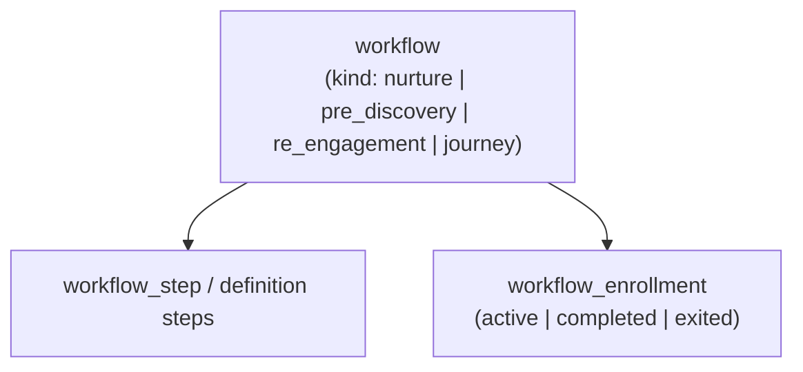
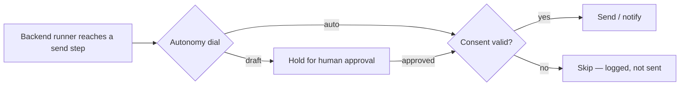

# Workflow automation guide

> **Audience:** anyone who needs to understand how automation actually runs in Imperion
> Business Manager — an employee authoring a sequence, an engineer touching the builder,
> or a reviewer checking that nothing sends without a gate. For the model overview and the
> kinds table, start at the [workflows README](README.md).

[← Workflows](README.md) · [Documentation library](../README.md) ·
[Agents](../agents/README.md) · [Customer lifecycle](../architecture/customer-lifecycle.md)

---

## 1. One engine, four faces

Everything automated in Imperion Business Manager runs on **one** substrate. Whether you
call it a nurture campaign, a pre-discovery sequence, a re-engagement push, or a marketing
journey, under the hood it is the same three tables:

| Table | What it holds |
| --- | --- |
| `workflow` | The sequence definition — `kind`, and for journeys the whole ordered step list in `definition` (jsonb). |
| `workflow_step` | An individual step (for the relational kinds). |
| `workflow_enrollment` | A contact's position in a sequence: `active | completed | exited` (one active per `(workflow, contact)`, idempotent). |

This "one object, many faces" design is deliberate (ADR-0073): a journey is authored,
versioned, and reasoned about as a single object, with no `journey_step` /
`journey_enrollment` child tables to keep in sync.

---

## 2. The two laws of automation here

### Law 1 — Authoring is not sending

This repository is **GUI only** (ADR-0042). The builder writes structure to the database;
it never reaches out. A `send` step you add is a *description of intent*, nothing more.
The **backend runner** executes steps, and only at runtime does anything leave the system.

### Law 2 — Every send passes a gate

At runtime the backend runner crosses **two** controls before any outreach:

1. The **approval gate + autonomy dial** (ADR-0058/0055) — depending on the workflow's
   autonomy setting, a step is either held as a *draft for a human* or allowed to run
   *auto*.
2. The **consent gate** (ADR-0014) — consent is re-asserted at execution time; an outreach
   step to a non-consented contact does not send.

> The practical upshot: you can build and save freely in the GUI without any risk of an
> accidental blast. The dangerous step — sending — is owned by the backend and gated twice.

---

## 3. The step kinds

**Relational workflows** (`nurture`, `pre_discovery`, `re_engagement`) use:
`send_email` · `send_sms` · `chat_prompt` · `agent_enrich` · `wait` · `branch`. The send
steps are consent-gated.

**Marketing journeys** (`kind = 'journey'`) use a journey-flavored set, defined in
`src/lib/journey.ts`:

| Step | Behavior |
| --- | --- |
| `send` | Send a composer template (gated per ADR-0058). A/B variants are send-step config, sticky per enrollee. |
| `wait` | Delay, in hours. |
| `branch` | Evaluate an engagement predicate (`opened | clicked | replied | bounced | no_action`) → if/else. |
| `score` | Apply a lead-score delta. |
| `exit` | Leave the journey. |

---

## 4. Authoring a marketing journey (the GUI surfaces)

The journey builder is the richest authoring surface and a good model for the others. All
routes are in this repo; all of them author structure only.

| Route | What you do |
| --- | --- |
| `/journeys` | List existing journeys. |
| `/journeys/new` | Create a journey. |
| `/journeys/[id]` | Read-only flow viewer (#397). |
| `/journeys/[id]/edit` | The **builder** (#399) — add/reorder/edit steps, author A/B variants, with live structural validation. |

Under the hood:

- The builder edits **one in-memory object** and saves the whole `definition` back via the
  data layer (`createJourney` / `saveJourney`, surfaced as the `createJourneyAction` /
  `saveJourneyAction` server actions).
- The server action **re-parses the untrusted blob** through `lib/journey.ts`
  (`parseJourneyDefinition`) before persisting — never trusting the client payload.
- `lib/journey.ts` also provides the validation and analysis the builder relies on:
  `validateJourneyDefinition` (structural rules), `summariseJourney`, A/B helpers
  (`variantSplit`, `allocateSplitPercent`, `splitPercentsSumTo100`, `selectWinner`),
  and step construction (`newJourneyStep`, `nextStepKey`, `describeStep`).

### Honest degradation

The builder degrades honestly where prerequisites are not yet in place (ADR-0073
decision 2):

- **Enrollment targeting is disabled** because the `segment` / `segment_member` model has
  no schema yet (#420 / #421). A journey still authors and saves — it simply cannot enrol
  until segments land.
- **Composer template fields are free-text ids** until a template index is wired.

This is intentional: the surface never fakes a capability it does not have, and never
blocks authoring on a missing downstream piece.

---

## 5. Pre-discovery: the human-in-the-loop pattern

Pre-discovery (ADR-0027) is the canonical example of automation feeding a human decision
rather than acting alone:

1. A `pre_discovery` workflow gathers data via chat/text/email + agent enrichment.
2. It pre-fills `engagement_answer` rows as **draft** (`source = agent|automation`, each
   with a `confidence`).
3. In the discovery call the salesperson **confirms or rejects** each answer
   (`confirmAnswer` / `rejectAnswer`), and the approving user is recorded.
4. The verdict routes the contact: **fit →** spawn an assessment (provenance FKs,
   ADR-0023); **not_fit →** enroll in a nurture workflow.

Nothing the agent proposed is treated as truth until a human stamps it — provenance and
approver are recorded for audit.

---

## 6. Workflows vs. ICM business processes

Two automation systems share the same philosophy but serve different domains:

| | Workflows (this area) | ICM workspaces |
| --- | --- | --- |
| **Domain** | Marketing / nurture / pre-discovery sequences against contacts. | Broader MSP **business processes**. |
| **Authored in** | The GUI builders (`/workflows`, `/journeys`). | `icm/` workspaces (the ICM factory, ADR-0061). |
| **Executed by** | The backend workflow runner. | The backend orchestrator. |
| **Gate** | Approval gate + autonomy dial + consent. | Per-workflow autonomy dial (draft → auto). |

Both keep core logic out of Power Automate (CLAUDE.md §3) and both gate sends. ICM is
documented in [agents/icm](../agents/icm.md) and `icm/CLAUDE.md`.

---

## See also

- [Workflows README](README.md) — the model overview and the kinds table.
- [Customer lifecycle](../architecture/customer-lifecycle.md) — the motion these workflows
  drive.
- [Reference / sales-marketing](../reference/sales-marketing/README.md) — the source GTM
  assets the nurture tracks are built from.
- [Decision records](../decision-records/README.md) — ADR-0073 (journeys), ADR-0058/0055
  (gates), ADR-0027 (pre-discovery), ADR-0014 (consent), ADR-0061 (ICM).
