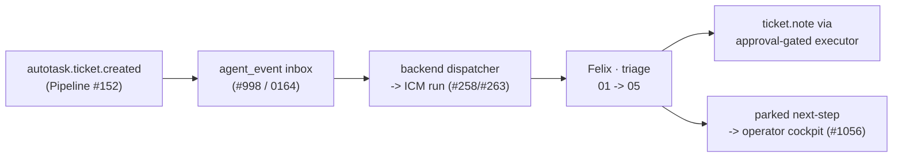

# Workflow: triage (service v1 — the Felix wedge)

**Job:** every newly-created ticket gets grounded, classified onto a troubleshooting
path **with the reasoning shown**, basically diagnosed (read-only), and handed to a
human with an executive-summary note and a recommended next step.

**Trigger:** a new ticket lands — `autotask.ticket.created`, delivered through the
durable wake-event inbox (`agent_event`, #998 / migration 0164) and drained by the
backend dispatcher into one ICM run (Pipeline #152 emits the event; the wake spine).
One run per ticket.

**Agent:** Felix, the Service agent ([`../felix.md`](../felix.md)). Sender/identity:
none — triage performs no outbound communication; its only write is an INTERNAL
Autotask work-note.

## Stages

| # | Stage | Job | Checkpoint |
|---|---|---|---|
| 01 | research | Assemble the issue dossier from the ticket + context | — |
| 02 | asset-status | Snapshot the affected asset's current state | — |
| 03 | classify-path | Severity/category + one path, with the decision logic written out | — |
| 04 | troubleshoot | Run the chosen path's basic, read-only diagnostic steps | — |
| 05 | summary-handoff | Internal exec-summary note + parked next-step proposal | **Yes** |

## Autonomy

Starts `draft` (ADR-0061). When flipped to `auto`, stage 05 may self-approve ONLY
the internal operational work-note (`ticket.note`) on green stage-03/04 audits with
internal-only content. **Identity / backups / domain-controller** symptoms are
`escalate-only` — stage 04 runs no steps. The next-step proposal, and anything
customer-facing, financial, or remediating, always parks for a human, in every mode.

## The first end-to-end tracer

This workflow is the wedge's first end-to-end demo, pairing the agent with the
already-built runtime, wake, and cockpit:

Runtime = backend #258/#263 · wake = #998 / Pipeline #152 · cockpit =
`/operator/technician` (#1056, over `agent_pending_action`).

## Runtime skills

Workflow-local (Tier 3, `./skills/`): `severity-rubric.md` ·
`troubleshooting-paths.md` — Mark-editable business content; stages cite, never
restate. Format rules: `../../../CONVENTIONS.md`. The structured manifest is
`agent.yaml`; the composed workflow prose is `prose.md`.
